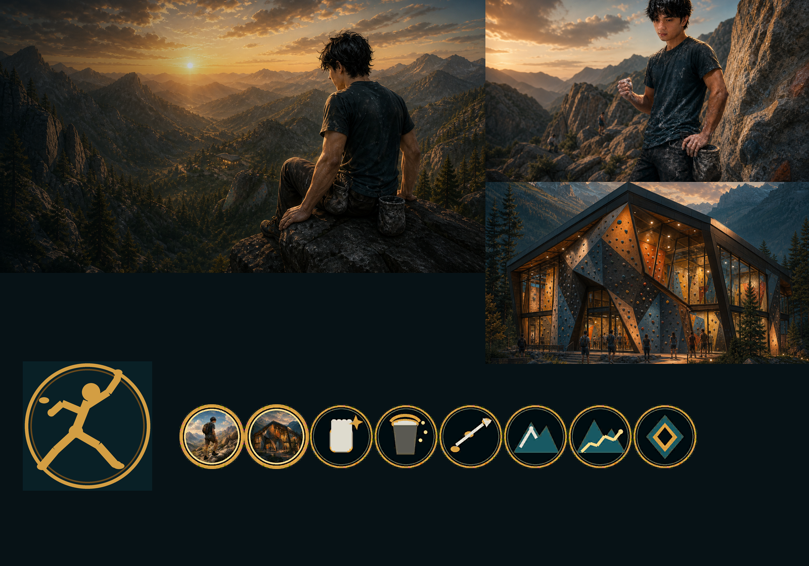

# Gabriel — The Relentless Projector

A complete custom civilization for **Sid Meier's Civilization V: Brave New World** using the **Community Patch**.

Gabriel leads **The Boulder Circuit**, a hills-focused civilization that learns from repeated attempts and from unfamiliar places. Its strongest routes are Science and methodical Domination, with Culture as a supporting path.



## Requirements

- Civilization V: Brave New World
- `(1) Community Patch` (mod ID `d1b6328c-ff44-4b0d-aad7-c657f83610cd`)
- Single-player; multiplayer and hotseat are deliberately disabled in the manifest because the target-state mechanic uses local persistent Lua storage

This mod depends only on the Community Patch component. It does not require the rest of Vox Populi.

## Installation

1. Download or clone the repository.
2. Copy the repository folder into `Documents/My Games/Sid Meier's Civilization 5/MODS`.
3. Start Civilization V, open **MODS**, and enable `(1) Community Patch` plus **Gabriel — The Relentless Projector**.
4. If the mod does not appear after replacing an older copy, clear the Civ V mod cache and restart the game.

## Civilization design

### Unique Ability — One More Go

When one of Gabriel's land combat units attacks an enemy unit without destroying it, that attacker begins **Projecting** that exact target.

| Attack against the same target | Combat bonus |
| --- | ---: |
| First | Normal |
| Second | +5% |
| Third | +10% |
| Fourth and later | +15% |

The project resets if the attacker chooses another enemy, the target dies or is captured, or two full turns pass without another attempt. Killing the target on the third or a later attack heals the attacker for 15 HP and grants 5 XP.

The bonus is applied only during combat with the stored target. It is not a generic promotion against every enemy.

### Fresh Sets

The first active land Trade Route to each destination city in an Era grants both Science and Culture equal to:

`15 + (5 × current Era index)`

Ancient routes grant 15 of each yield, Classical routes 20, and so on through 50 in the Information Era. Domestic, major-civilization, and City-State destinations are all valid. The destination list resets naturally when the player's Era changes.

### Unique Unit — Gym Hopper

Replaces the Scout.

- 5 Combat Strength, 3 Movement, 2 Sight, 30 Production
- **Try Something New:** double movement through Hills and +15% Defense on Hills
- Gains +2 XP once for the first entry into each other major civilization's or City-State's territory
- On upgrade, the exploration ability ends and the unit gains permanent **Hill Familiarity**: +10% Defense on Hills

Unlike a normal Scout, the Gym Hopper does not ignore every terrain cost; its movement specialty is specifically Hills.

### Unique Building — Bouldering Gym

Replaces the Barracks and inherits the live Community Patch Barracks fields and domain experience.

- +15 XP to trained land units (and any other domain experience carried by the current CP Barracks definition)
- +1 Culture
- +1 Local Happiness
- Trained land combat units receive permanent **Route Reading**: +10% Combat Strength when attacking or defending on Hills

## Implementation notes players should know

- **Combat preview:** Determination appears as a visible promotion, but the +5/+10/+15 modifier is attached at the Community Patch battle hook after the normal pre-combat preview is drawn. The resolved combat uses the correct bonus.
- **Fresh Sets timing:** route state is checked at the start of Gabriel's turn. A route created during a turn normally pays its reward at the start of the next turn. This is the stable CP-only equivalent of an establishment event.
- **Destination identity:** Fresh Sets keys destinations by map coordinates and Era. Capturing, razing, or refounding a city on the same plot cannot produce duplicate rewards in one Era.
- **Game speed:** the explicit 15/20/25/etc. table is intentionally not game-speed scaled.
- **Acquired units:** captured or gifted Gym Hoppers retain their unique exploration behavior. One More Go itself belongs to Gabriel, so a projector's state is cleared when the unit changes owners.
- **Save/load:** project targets, stacks, last-attempt turns, destination visits, and Gym Hopper lineage use `Modding.OpenSaveData`. Temporary combat bonuses are scrubbed on initialization and every Gabriel turn.

More technical detail and the full edge-case policy are in [IMPLEMENTATION_NOTES.md](IMPLEMENTATION_NOTES.md). A manual test matrix is in [TESTING.md](TESTING.md).

## Art

The supplied concept sheet is preserved at `Art/Source/Gabriel_Bouldering_Concept.png`. Custom leader, Dawn of Man, Gym Hopper, and Bouldering Gym masters are also retained in `Art/Source`. The reproducible Pillow pipeline creates DXT5 DDS screens, all registered atlas sizes, a unit flag, and the preview above.

To rebuild the game art with Python 3 and Pillow 12+:

```powershell
python Tools/build_art.py
```

Every atlas size is rendered directly from a source master or vector recipe rather than being resized from a smaller atlas.

## Validation

With Civ V's debug database present in the normal user cache:

```powershell
python Tools/update_modinfo_hashes.py
python Tools/validate_database.py
```

The validator applies both SQL files to an in-memory copy of the database, then verifies unique rows, stats, promotions, copied Barracks experience, localization, diplomacy coverage, atlas sizes, screen sizes, leader scene XML, Lua hook presence, dependency metadata, file existence, and every modinfo MD5.

## Repository map

- `SQL/01_Gabriel_Core.sql` — gameplay database, civilization, leader, AI, units, building, promotions, and atlases
- `SQL/02_Gabriel_Text.sql` — English localization, Civilopedia, names, and diplomacy
- `Lua/Gabriel_Gameplay.lua` — all stateful mechanics
- `Art/` — source masters, generated DDS files, static leader scene, and preview
- `Tools/` — deterministic art build and offline validation
- `Docs/` — implementation audit material
